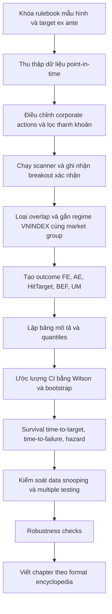

# Framework chương Bulkowski cho Việt Nam

Tài liệu này chuyển nghiên cứu GPT Pro thứ ba do người dùng cung cấp (`P3`)
thành framework chấm và dựng chương cho dự án.

P3 được dùng như hướng dẫn phương pháp. Các trích dẫn dạng `turn...` trong P3
không phải nguồn bền vững có thể kiểm tra lại, nên không được chép vào chương
công bố cho tới khi truy được nguồn gốc thật.

## Vai trò

Framework này nằm trên hai contract hiện có:

- [`bulkowski-vietnam-methodology-contract.md`](bulkowski-vietnam-methodology-contract.md):
  khóa tư cách nghiên cứu và ranh giới claim
- [`bulkowski-vietnam-statistics-contract.md`](bulkowski-vietnam-statistics-contract.md):
  khóa bộ chỉ tiêu và bảng thống kê
- [`bulkowski-vietnam-release-gate.md`](bulkowski-vietnam-release-gate.md):
  khóa pass/fail, severity, red-team risks và artifact tái lập trước publish

Framework này trả lời câu hỏi: một chương đã đủ giống một entry thực nghiệm kiểu
Bulkowski chưa, và nếu chưa thì đang bị chặn ở gate nào.

## Giả Định Phải Khóa Trước Khi Viết Chương

Mỗi chapter phải khai báo rõ:

- timeframe cơ sở: daily OHLCV hay weekly
- dữ liệu giá đã điều chỉnh corporate actions hay raw
- có hay không OHLC path đầy đủ sau breakout
- universe toàn thị trường là toàn bộ cổ phiếu đủ điều kiện hay benchmark chính
  thức như VNX Allshare
- rule lọc thanh khoản, giá tối thiểu, số phiên giao dịch hữu hiệu, tuổi niêm yết
- chính sách overlap cho nhiều mẫu trên cùng mã/cùng đoạn giá
- horizon đánh giá: 20/60/120/250 phiên, ultimate, hoặc cả hai
- target rule là pattern-specific hay target cơ học tạm thời
- xử lý đình chỉ, hủy niêm yết, chuyển sàn, biên độ giá nhiều phiên sau breakout

Nếu các giả định này chưa khóa, chương chỉ được xem là research draft.

## Xương Sống Một Chapter

Một chapter kiểu Bulkowski cho Việt Nam phải có chuỗi sau:

```text
rulebook hình học và target ex ante
-> dữ liệu point-in-time
-> scanner breakout xác nhận
-> de-overlap và gắn context
-> outcome FE/AE/target/failure/ultimate
-> quantile và CI
-> survival/time-to-event khi có path
-> robustness và data-snooping control
-> PDF encyclopedia entry
```

## Tám Lớp Thống Kê Tối Thiểu

| Lớp | Bắt buộc tối thiểu | Lý do |
|---|---|---|
| Dữ liệu point-in-time | universe, membership theo thời điểm, corporate actions, liquidity filter, exclusion list | chống survivorship, membership lookahead và distortion dữ liệu |
| Mô tả số lượng | N event, N ticker, N theo hướng breakout, regime, market group | không có N thì mọi tỷ lệ đều dễ gây ảo giác |
| Phân phối và phân vị | q1/q5/q10/q25/q50/q75/q90/q95/q99 cho biến liên tục chính | mean/median không đủ để thấy tail và skew |
| Khoảng tin cậy | 95% CI cho tỷ lệ; bootstrap CI cho median/quantile | point estimate không đủ để so sánh |
| Kiểm định khác biệt | up/down, bull/bear, VN30/outside VN100, interaction khi đủ mẫu | tránh kể chuyện từ nhiễu |
| Bootstrap phụ thuộc | block/stationary/bootstrap theo cụm mã khi cần | pattern outcomes không iid |
| Survival/time-to-event | KM tối thiểu; log-rank/Cox/discrete hazard khi đủ dữ liệu | xử lý đúng right censoring và câu hỏi "bao lâu" |
| Cỡ mẫu và power | nhãn exploratory cho strata nhỏ, precision target cho tỷ lệ chính | N tổng không thay thế N theo strata |

## Checklist Chương Nghiên Cứu

| Hạng mục | Điều kiện đạt |
|---|---|
| Dữ liệu point-in-time | ghi rõ universe, ngày hiệu lực membership, corporate-action treatment, exclusion rules |
| Định nghĩa mẫu | có rule nhận diện, breakout confirmation, target, failure |
| Cỡ mẫu | có N tổng, N theo breakout direction, N theo bull/bear, N theo market group |
| Bảng cốt lõi | đủ bảng tóm tắt, direction split, regime split, failure/target, post-breakout behavior |
| Phân phối | đủ quantiles 1/5/10/25/50/75/90/95/99 cho biến liên tục chính |
| Bất định | tỷ lệ chính có 95% CI; median/quantile chính có bootstrap CI |
| Time-to-event | có ít nhất KM cho target-hit và failure khi có OHLC path |
| Data snooping control | nêu số biến thể scanner/horizon/subgroup đã thử và correction khi cần |
| Robustness | sensitivity theo liquidity filter, overlap policy, regime definition, horizon definition |
| Minh bạch diễn giải | ghi rõ chapter là investment reference, không phải trading system |
| Hạn chế | liệt kê được ít nhất 5 hạn chế thật sự |
| Tái lập | có data dictionary, codebook khái niệm, sample extraction rule |

## Điểm Chương /100

| Tiêu chí | Điểm tối đa | Điều kiện lấy trọn điểm |
|---|---:|---|
| Nền dữ liệu point-in-time | 15 | universe, membership, corporate actions, liquidity filters minh bạch |
| Định nghĩa mẫu và breakout | 15 | rulebook rõ, không hậu nghiệm, có scanner validation |
| Bảng thống kê cốt lõi | 15 | đủ 5 bảng bắt buộc, cấu trúc nhất quán với chapter khác |
| Phân tầng theo context | 10 | ít nhất breakout direction và bull/bear; tốt hơn nếu có market group |
| Failures và targets | 10 | có BEF, HitTarget, MissTarget, unresolved/censored, overshoot/undershoot |
| Phân phối và phân vị | 10 | đủ quantiles, không dùng mean/median đơn độc |
| Khoảng tin cậy và bootstrap | 10 | tỷ lệ có CI, median/quantile có bootstrap CI phù hợp |
| Survival/hazard | 5 | có KM; trọn điểm nếu có log-rank/Cox/discrete hazard |
| Multiple testing/snooping control | 5 | có correction khi so nhiều pattern/horizon/spec |
| Robustness checks | 3 | có sensitivity theo overlap, regime algorithm, horizon |
| Minh bạch giới hạn và không overclaim | 2 | tách rõ recognition/reference/system và giới hạn thực thi |

Ngưỡng đọc điểm:

- 90-100: rất gần một encyclopedia entry cấp học thuật-thực chứng
- 85-89: đạt tinh thần Bulkowski rõ ràng, dùng được làm chapter chuẩn
- 75-84: khung tốt nhưng còn thiếu một số tầng suy luận/robustness
- 60-74: có giá trị mô tả, chưa đủ làm tài liệu tham khảo đầu tư nghiêm túc
- dưới 60: chủ yếu là tài liệu nhận diện hoặc ghi chép mô tả

## Gate Loại Trực Tiếp

Các gate này giới hạn điểm tối đa bất kể các mục khác nhìn tốt đến đâu:

| Lỗi thiết kế | Điểm tối đa |
|---|---:|
| Có lookahead membership hoặc lookahead regime chưa xử lý | 60 |
| Không có corporate-action treatment point-in-time | 50 |
| Không tách kết quả theo breakout direction hoặc không báo N theo strata | 70 |
| Không có rule target ex ante theo từng pattern | 70 |
| Chỉ có scanner output tổng hợp, không có OHLC path sau breakout cho time-to-event/retest | 80 |
| Không công khai caveat và lane tài liệu | 75 |

Release gate chi tiết nằm ở
[`bulkowski-vietnam-release-gate.md`](bulkowski-vietnam-release-gate.md). Nếu
một mục `High` severity fail, chapter phải ở trạng thái `Hold` dù điểm framework
trông đủ cao.

## Pipeline Tối Thiểu



## Bảng Và Chỉ Số Bổ Sung

P3 nhấn mạnh các chỉ số nên đi vào pipeline sau P0:

| Chỉ số | Ý nghĩa |
|---|---|
| `Race(+5%,-5%)` | xác suất mẫu đi đúng 5% trước khi đi ngược 5% |
| `Race(Target,-5%)` | target hit có xảy ra trước adverse move hay không |
| `RTR = FE / TD` | kiểm tra target rule quá gần hay quá xa |
| `MFE/MAE asymmetry` | tóm tắt reward/risk cấp pattern |
| `Conditional after TBPB` | hành vi sau throwback/pullback |
| `KM Target@20/60/120/250` | xác suất đạt target theo horizon có censoring |
| `Unresolved rate` | cảnh báo pattern đúng nhưng quá chậm hoặc thiếu hậu dữ liệu |

Các biến liên tục chính nên dùng quantile set mở rộng:

```text
q1, q5, q10, q25, q50, q75, q90, q95, q99
```

Áp dụng cho `Dur`, `PH`, `TD`, `FE(H)`, `AE(H)`, `UM`, `T_target`,
`T_fail`, `Loop`, `Overshoot`, `Undershoot`, `RTR`.

## Biểu Đồ Nên Có

| Biểu đồ | Mục đích |
|---|---|
| ECDF hoặc quantile fan của `UM`, `FE`, `AE` | cho thấy shape outcome tốt hơn mean/median |
| Forest plot với CI theo subgroup | so bull/bear, up/down, VN30/outside rõ hơn |
| Kaplan-Meier hoặc CIF curves | trả lời "bao lâu đạt target/failure" với censored data |
| Heatmap regime x direction x market group | nhìn nhanh interaction và nơi sample mỏng |
| Scatter `TD` vs `HitT` hoặc `RTR` | phát hiện target rule quá chặt/quá xa |

## Ranh Giới Việt Nam

Chương Bulkowski-style cho Việt Nam nên báo cáo cả downward breakouts, nhưng
không được ngầm gợi ý long-side và short-side có cùng khả năng thực thi trên thị
trường cổ phiếu cơ sở Việt Nam.

Trong chapter nghiên cứu:

- breakout xuống có thể có informational value
- trade implementation value phải được đánh giá riêng
- các yếu tố price limit, thanh khoản, đình chỉ, chuyển sàn và corporate actions
  phải được ghi trong data-integrity/caveat block
